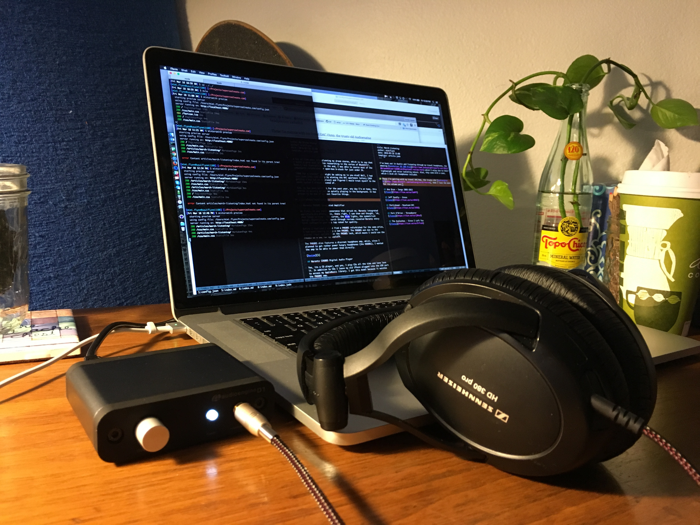

I've been in Austin part of this month and listening through my travel headphone rig: the amazing [Sennheiser HD 380 Pros](http://www.theaudiophileworld.net/2012/04/sennheiser-hd380-professional-review.html) paired with my trusty old [Audioengine D1](http://www.whathifi.com/audioengine/d1/review).

The lightweight and noise isolating nature of the HD 380 Pros is why I favor them for long days working from coffee shops. As an added bonus that they come with a case that the 'phones fold flat into and fits nicely in my computer bag.

My favorite feature of the D1 is its volume pot. Digital stepped up volume controls on computers tend to bother me. I want to control my volume in a more tangible way.
 
[Ane Brun - Songs 2003-2013](https://itun.es/us/3aNFP)

[Jeff Buckly - Grace](https://itun.es/us/eRGGl)

[Portishead - Roseland NYC](https://itun.es/us/JX5B)

[Port O'Brien - Threadbare](https://itun.es/us/j0AuA)

[The Avalaches - Since I Left You](https://itun.es/us/ErTcab)
